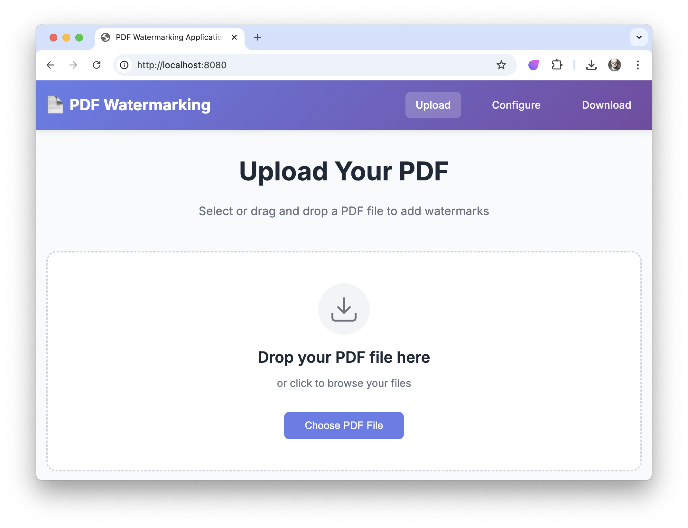
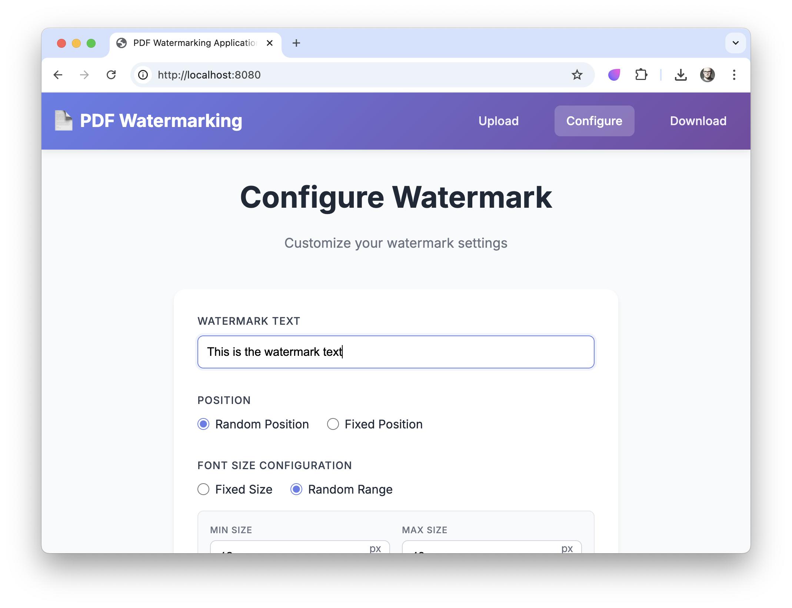
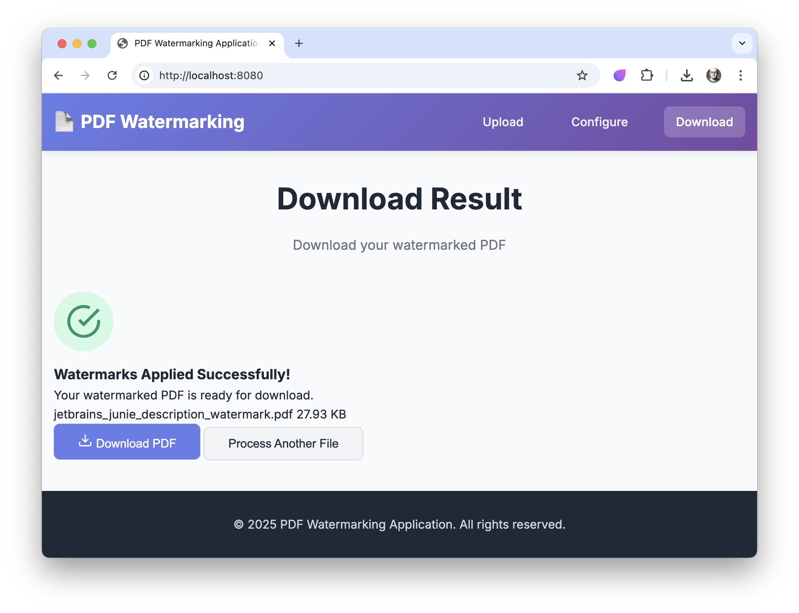

# PDF Watermarking Application

A comprehensive web-based PDF watermarking service built with modern Scala technologies. This application allows users to upload PDF documents and apply highly customizable watermarks with extensive configuration options including positioning, orientation, font properties, colors, and multiple watermark support.

## 🚀 Features

### Core Functionality
- **PDF File Upload**: Web-based file upload with drag-and-drop support and validation
- **Watermark Text Configuration**: Customizable text content for watermarks
- **Real-time Preview**: Live preview of watermark configurations before processing
- **Processed File Download**: Download watermarked PDFs with proper file handling

### Advanced Watermark Configuration

#### Positioning Options
- **Fixed Position**: Specify exact X/Y coordinates for watermark placement
- **Random Position**: Automatic random positioning with overlap detection and avoidance

#### Orientation Controls
- **Fixed Orientation**: Set specific rotation angles (0-360 degrees)
- **Random Orientation**: Automatic random rotation with readability preservation

#### Font Size Configuration
- **Fixed Font Size**: Set specific font sizes with validation
- **Random Font Size**: Define minimum and maximum font size ranges
- **Dynamic Scaling**: Automatic font scaling based on page size

#### Color Customization
- **Fixed Color**: RGB/Hex color picker with visual preview
- **Random Color**: Generate random colors for individual letters
- **Contrast Optimization**: Automatic contrast checking against backgrounds
- **Color Palette Presets**: Pre-defined color schemes and recommendations

#### Multiple Watermarks
- **Quantity Control**: Configure the number of watermarks per document
- **Distribution Algorithms**: Smart watermark distribution across pages
- **Overlap Detection**: Automatic spacing to prevent excessive overlap
- **Performance Warnings**: Alerts for high watermark quantities

### User Interface
- **Responsive Design**: Mobile-friendly interface that adapts to different screen sizes
- **Wizard-Style Navigation**: Step-by-step configuration process
- **Dynamic Form Sections**: Context-aware form fields based on selections
- **Configuration Summary**: Review page before processing
- **Helpful Tooltips**: User guidance and keyboard shortcuts
- **Progress Indicators**: Real-time feedback during upload and processing

## 🛠 Technology Stack

- **Language**: Scala 3.3.6
- **Effect System**: ZIO 2.1.9 for functional programming and concurrency
- **Web Framework**: ZIO HTTP 3.0.0 for HTTP server and routing
- **PDF Processing**: Apache PDFBox 3.0.3 for PDF manipulation
- **JSON Processing**: ZIO JSON 0.7.3 for API serialization
- **Configuration**: ZIO Config 4.0.2 with Typesafe Config support
- **Testing**: ZIO Test 2.1.9 and ScalaTest 3.2.19
- **Logging**: ZIO Logging 2.3.1 with SLF4J and Logback
- **Build Tool**: SBT with Scala 3 compatibility

## 📋 Prerequisites

- **Java**: JDK 11 or higher
- **Scala**: 3.3.6 (managed by SBT)
- **SBT**: 1.8+ (for building and running)
- **Memory**: Minimum 2GB RAM recommended for processing large PDFs

## 🚀 Quick Start

### Installation

1. **Clone the repository**:
   ```bash
   git clone https://github.com/yourusername/pdf-watermarks.git
   cd pdf-watermarks
   ```

2. **Build the project**:
   ```bash
   sbt compile
   ```

3. **Run tests**:
   ```bash
   sbt test
   ```

4. **Start the application**:
   ```bash
   sbt run
   ```

The application will start on `http://localhost:8080` by default.

### Configuration

The application can be configured through `src/main/resources/application.conf`:

```hocon
http {
  host = "localhost"
  port = 8080
  maxRequestSizeBytes = 104857600  # 100MB
}

watermark {
  maxWatermarks = 100
  defaultFontSize = 12
  tempFileRetentionMinutes = 60
}
```

### Usage

#### Web Interface

1. **Access the Application**: Navigate to `http://localhost:8080` in your web browser
2. **Upload PDF**: Use the drag-and-drop interface or file picker to upload a PDF
3. **Configure Watermarks**:
   - Enter watermark text
   - Choose positioning (fixed coordinates or random)
   - Set orientation (fixed angle or random rotation)
   - Configure font size (fixed or random range)
   - Select colors (fixed or random per letter)
   - Specify number of watermarks
4. **Preview**: Review the watermark configuration in the real-time preview
5. **Process**: Submit the configuration to apply watermarks
6. **Download**: Download the processed PDF file

#### Command Line Interface

For testing and automation, use the CLI:

```bash
sbt "run --cli --input input.pdf --output output.pdf --text 'CONFIDENTIAL' --position random --color red"
```

## 📸 Screenshots

Here are some screenshots showcasing the application's web interface and functionality:

### Main Interface - File Upload and Configuration

*The main application interface showing the file upload area and watermark configuration options*

### Watermark Configuration Options

*Detailed watermark configuration panel with positioning, orientation, font size, and color options*

### Preview and Processing

*Real-time preview functionality and processing interface before downloading the watermarked PDF*

## 🏗 Development

### Project Structure

```
pdf-watermarks/
├── src/
│   ├── main/
│   │   ├── scala/
│   │   │   └── com/pdfwatermarks/
│   │   │       ├── cli/              # Command-line interface
│   │   │       ├── config/           # Application configuration
│   │   │       ├── domain/           # Domain models and types
│   │   │       ├── http/             # HTTP server and routes
│   │   │       ├── pdf/              # PDF processing and watermarking
│   │   │       └── services/         # Business logic services
│   │   └── resources/
│   │       ├── static/               # Web UI assets (HTML/CSS/JS)
│   │       └── application.conf      # Configuration file
│   └── test/
│       └── scala/                    # Test files
├── docs/                             # Project documentation
├── build.sbt                        # Build configuration
└── README.md
```

### Development Workflow

1. **Setup Development Environment**:
   ```bash
   # Install dependencies
   sbt compile
   
   # Run in development mode with auto-reload
   sbt ~run
   ```

2. **Running Tests**:
   ```bash
   # Run all tests
   sbt test
   
   # Run tests with coverage
   sbt coverage test coverageReport
   
   # Run specific test suite
   sbt "testOnly *HttpServerTest"
   ```

3. **Code Quality**:
   ```bash
   # Format code
   sbt scalafmt
   
   # Check for issues
   sbt scalafix
   ```

### Testing

The project includes comprehensive test coverage:

- **Unit Tests**: Core business logic testing with ZIO Test
- **Integration Tests**: HTTP endpoint and PDF processing tests
- **Property-Based Tests**: Edge case testing with ScalaCheck
- **Test Coverage**: Minimum 85% statement coverage required

Example test execution:
```bash
sbt "testOnly com.pdfwatermarks.pdf.WatermarkRendererTest"
```

## 📖 API Documentation

### HTTP Endpoints

#### File Upload
```http
POST /api/upload
Content-Type: multipart/form-data

# Response
{
  "success": true,
  "sessionId": "uuid",
  "message": "File uploaded successfully"
}
```

#### Process Watermark
```http
POST /api/process
Content-Type: application/json

{
  "sessionId": "uuid",
  "config": {
    "text": "CONFIDENTIAL",
    "position": {"type": "random"},
    "orientation": {"type": "fixed", "angle": 45},
    "fontSize": {"type": "fixed", "size": 12},
    "color": {"type": "random"},
    "quantity": 5
  }
}
```

#### Download File
```http
GET /api/download/{sessionId}

# Response: PDF file with appropriate headers
```

#### Health Check
```http
GET /health

# Response
{
  "status": "healthy",
  "timestamp": "2024-08-22T20:06:00Z"
}
```

## 🤝 Contributing

We welcome contributions! Please follow these guidelines:

### Development Guidelines

1. **Follow Scala Best Practices**: Use functional programming principles and ZIO patterns
2. **Write Tests**: Include unit tests for all new functionality
3. **Documentation**: Update documentation for API changes
4. **Code Style**: Use provided Scalafmt configuration

### Contribution Process

1. **Fork the Repository**: Create a fork of the project
2. **Create Feature Branch**: `git checkout -b feature/your-feature-name`
3. **Make Changes**: Implement your feature with tests
4. **Run Quality Checks**:
   ```bash
   sbt scalafmt test coverage
   ```
5. **Submit Pull Request**: Create a PR with clear description

### Issue Reporting

- Use GitHub Issues for bug reports and feature requests
- Include reproduction steps for bugs
- Provide system information (OS, Java version, etc.)

## 📝 License

This project is licensed under the MIT License. See the [LICENSE](LICENSE) file for details.

## 🆘 Support

- **Documentation**: Check the `docs/` directory for detailed documentation
- **Issues**: Report bugs and request features via GitHub Issues
- **Discussions**: Use GitHub Discussions for questions and community support

## 🗂 Project Status

This project is actively developed following a phased approach:

- ✅ **Phase 1**: Foundation and Core Infrastructure (Complete)
- ✅ **Phase 2**: Web Interface and Basic Functionality (Complete)
- ✅ **Phase 3**: Advanced Watermark Features (Complete)
- 🔄 **Phase 4**: Production Readiness and Quality Assurance (In Progress)

For detailed progress tracking, see [docs/tasks.md](docs/tasks.md).

## 🙏 Acknowledgments

- **ZIO Team**: For the excellent functional effect system
- **Apache PDFBox**: For comprehensive PDF processing capabilities
- **Scala Community**: For the robust ecosystem and tooling

---

**Built with ❤️ using Scala, ZIO, and functional programming principles**