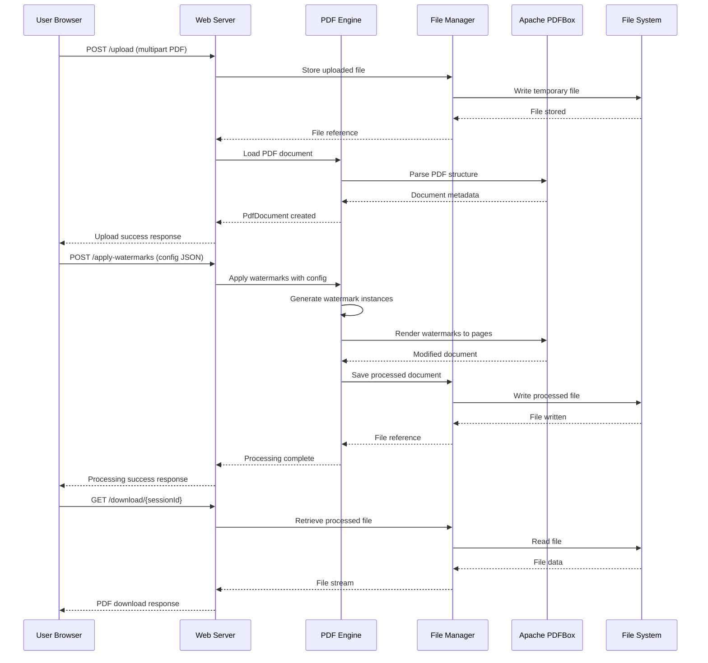
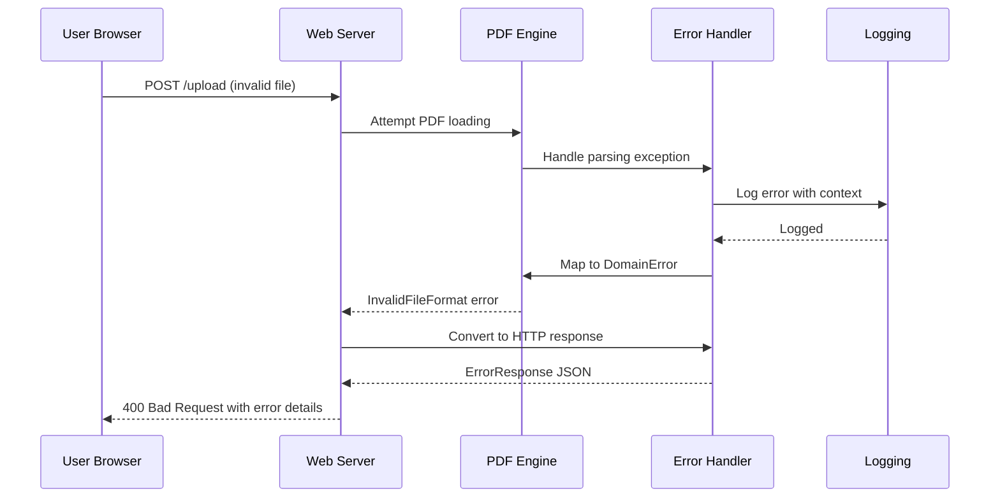
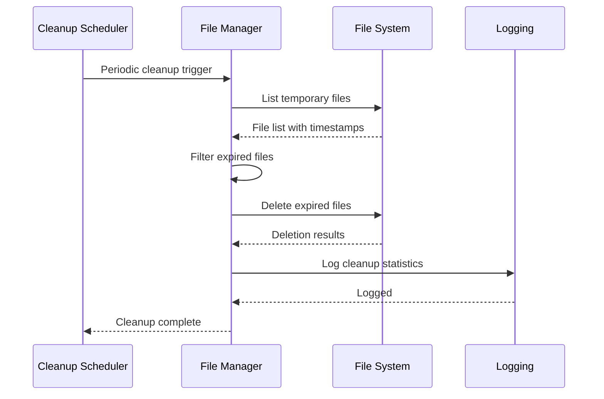

# PDF Watermarking Application - Architecture Documentation

**Version**: 1.0  
**Date**: 2025-08-22  
**Author**: Architecture Analysis  
**Status**: Production Ready  

## Table of Contents

1. [Scope & Audience](#scope--audience)
2. [Architecture Overview (C4 Model)](#architecture-overview-c4-model)
3. [Domain Model](#domain-model)
4. [ZIO-Specific Architecture](#zio-specific-architecture)
5. [Quality Attributes & Trade-offs](#quality-attributes--trade-offs)
6. [Runtime Behavior](#runtime-behavior)
7. [Architecture Decision Records](#architecture-decision-records)

## Scope & Audience

### Intended Audience
- **Backend Developers**: Scala developers working on PDF processing and ZIO-based applications
- **Site Reliability Engineers**: Operations teams responsible for deployment and monitoring
- **New Contributors**: Engineers joining the project who need to understand the architecture

### System Elevator Pitch
The PDF Watermarking Application is a sophisticated web-based service built with Scala 3 and ZIO that enables users to upload PDF documents and apply highly configurable watermarks through an intuitive web interface. The system supports advanced watermarking features including fixed/random positioning, rotation, font scaling, per-letter coloring, and multiple watermark instances, all implemented using functional programming principles with comprehensive error handling, performance monitoring, and production-ready operational capabilities.

### Non-Goals
This documentation does not cover:
- Detailed API specifications (see separate API documentation)
- Deployment infrastructure and DevOps procedures
- Frontend implementation details
- Performance benchmarking results
- Security audit findings

## Architecture Overview (C4 Model)

### C1: System Context


The PDF Watermarking Application operates as a standalone web service that:
- Accepts PDF uploads from web browser users via HTTP
- Processes watermark configurations through JSON APIs
- Integrates with Apache PDFBox for PDF manipulation
- Manages temporary files on the local/network file system
- Provides health monitoring endpoints for operations teams

**Key External Dependencies:**
- **Apache PDFBox 3.0.3**: PDF processing and manipulation library
- **JVM Runtime**: Effect execution and memory management
- **File System**: Temporary storage for uploaded and processed documents

### C2: Container Architecture


The application consists of four main containers:

1. **Web Server (ZIO HTTP 3.0.0)**: HTTP request handling, static content serving, session management
2. **PDF Processing Engine (Scala 3.3.6 + ZIO 2.1.9)**: Core business logic, watermark rendering, PDF manipulation
3. **File Management (ZIO + File I/O)**: Upload processing, temporary file lifecycle, download serving
4. **Configuration Service (ZIO Config 4.0.2)**: Application settings, environment management, validation rules

**Runtime Technologies:**
- Scala 3.3.6 with ZIO 2.1.9 ecosystem
- Apache PDFBox 3.0.3 for PDF operations
- ZIO HTTP 3.0.0 for web server functionality
- ZIO Config 4.0.2 for configuration management
- Logback 1.4.14 with SLF4J2 for structured logging

### C3: Component Architecture


The PDF Processing Engine contains sophisticated components organized in layers:

**Service Layer**: PDF Processing Service, Watermark Rendering Service, Validation Service  
**Core Components**: PDF Processor, Watermark Renderer, PDF Manipulator  
**Domain Layer**: Rich domain models with comprehensive watermark configuration types  
**Utilities**: Font Scaling, Color Management, Position Calculation utilities  
**Infrastructure**: Error handling patterns, performance monitoring, structured logging

### C4: Code Organization

```
src/main/scala/com/pdfwatermarks/
├── domain/           # Domain models and business logic
│   └── Models.scala  # WatermarkConfig, PdfDocument, enums
├── services/         # Service interfaces and implementations
│   ├── Services.scala
│   ├── Layers.scala  # ZIO dependency injection
│   └── TempFileManagementService.scala
├── pdf/              # PDF processing core
│   ├── PdfProcessor.scala
│   ├── WatermarkRenderer.scala
│   └── PdfManipulator.scala
├── http/             # Web server and REST API
│   └── HttpServer.scala
├── config/           # Configuration management
│   └── ApplicationConfig.scala
├── errors/           # Error handling patterns
│   └── ErrorHandling.scala
└── logging/          # Structured logging
    └── StructuredLogging.scala
```

## Domain Model

### Core Entities

#### PdfDocument
Represents a PDF document throughout its processing lifecycle:
```scala
case class PdfDocument(
  id: String,
  filename: String,
  originalSize: Long,
  pageCount: Int,
  uploadedAt: Instant,
  status: DocumentStatus,
  sourceFilePath: Option[String],
  processedFilePath: Option[String]
)
```

#### WatermarkConfig  
Comprehensive configuration for watermark customization:
```scala
case class WatermarkConfig(
  text: String,
  position: PositionConfig,      // Fixed coordinates, Random, Templates
  orientation: OrientationConfig, // Fixed angle, Random, Presets
  fontSize: FontSizeConfig,      // Fixed, Random range, Dynamic scaling
  color: ColorConfig,            // Fixed color, Random per letter, Palettes
  quantity: Int                  // Number of watermark instances
)
```

### Configuration Enums
The domain model uses Scala 3 enums extensively for type-safe configuration:

- **PositionConfig**: `Fixed(x, y)`, `Random`, `Template(PositionTemplate)`
- **OrientationConfig**: `Fixed(angle)`, `Random`, `Preset(OrientationPreset)`
- **FontSizeConfig**: `Fixed(size)`, `Random(min, max)`, `DynamicScale`, `Recommended(DocumentType)`
- **ColorConfig**: `Fixed(color)`, `RandomPerLetter`, `Palette(ColorPalette)`

### Value Objects & Utilities

#### FontScaling
Mathematical utilities for intelligent font sizing:
- Page dimension-based scaling calculations  
- Document type awareness (Legal, Academic, Business, etc.)
- Accessibility considerations for readability

#### ColorUtils
Advanced color management:
- Predefined palettes (Professional, Vibrant, Pastel, etc.)
- Contrast analysis for readability
- Per-letter randomization with seed-based reproducibility

#### PositionUtils  
Sophisticated positioning algorithms:
- Template-based positioning (corners, center, grid patterns)
- Overlap detection and collision avoidance
- Boundary validation within page dimensions

### Ubiquitous Language

**Watermark Instance**: A single rendered watermark with specific position, rotation, font size, and color  
**Processing Session**: A user's workflow from upload through download  
**Template Positioning**: Predefined layouts like corners, center, grid arrangements  
**Dynamic Font Scaling**: Automatic font size adjustment based on page dimensions  
**Per-Letter Coloring**: Individual color assignment to each character in watermark text  
**Document Type Classification**: Legal, Academic, Business categories affecting rendering parameters  

### Data Lifecycle

1. **Creation**: PDF uploaded → PdfDocument created with metadata extraction
2. **Processing**: Watermark configuration applied → Document status updated
3. **Storage**: Processed document temporarily stored with cleanup scheduling  
4. **Delivery**: Download served → Session cleanup initiated
5. **Archival**: Temporary files cleaned up based on configurable retention policies

## ZIO-Specific Architecture

### Effects & Environment

The application models all side effects using ZIO's effect system:

```scala
type ApplicationEffect[A] = ZIO[ApplicationEnvironment, DomainError, A]

type ApplicationEnvironment = 
  PdfProcessingService & 
  WatermarkRenderingService & 
  FileManagementService & 
  SessionManagementService & 
  ValidationService &
  TempFileManagementService &
  DownloadTrackingService &
  ApplicationConfig
```

**Effect Modeling Principles:**
- All I/O operations wrapped in ZIO effects
- Typed error channel with domain-specific errors
- Resource management through ZIO's automatic cleanup
- Interruption safety for graceful shutdowns

### ZLayer Design

#### Service Architecture
Each major service is implemented as a ZIO service with both live and test implementations:

```scala
// Service interface
trait PdfProcessingService {
  def loadPdf(file: File): IO[DomainError, PdfDocument]
  def applyWatermarks(document: PdfDocument, config: WatermarkConfig): IO[DomainError, File]
}

// Live implementation
case class PdfProcessingServiceLive() extends PdfProcessingService {
  // Production implementation using PDFBox
}

// Test implementation  
case class PdfProcessingServiceTest() extends PdfProcessingService {
  // Mock implementation for testing
}
```

#### Layer Composition
Services are wired through ZIO layers with clear dependency management:

```scala
val appLayer: ZLayer[Any, Nothing, ApplicationEnvironment] = {
  val configLayer = ApplicationConfig.layer.orDie
  val pdfProcessingLayer = ZLayer.succeed(PdfProcessingServiceLive())
  val watermarkRenderingLayer = ZLayer.succeed(WatermarkRenderingServiceLive())
  // ... other services
  
  configLayer ++ pdfProcessingLayer ++ watermarkRenderingLayer ++ /* ... */
}
```

#### Dependency Injection Benefits
- **Compile-time safety**: Missing dependencies caught during compilation
- **Test isolation**: Easy substitution of mock implementations  
- **Environment composition**: Clean separation of concerns
- **Resource management**: Automatic lifecycle handling

### Concurrency Model

#### Fiber-based Architecture
- **Structured Concurrency**: All concurrent operations supervised
- **Interruption Safety**: Graceful handling of cancellation
- **Resource Cleanup**: Automatic cleanup on interruption
- **Non-blocking I/O**: File operations use ZIO's async primitives

#### Processing Strategies
```scala
// Concurrent watermark application for multiple instances
def applyMultipleWatermarks(
  instances: List[WatermarkInstance]
): ZIO[Environment, DomainError, List[Unit]] = {
  ZIO.foreachPar(instances) { instance =>
    applyWatermarkInstance(instance)
  }.withParallelism(4) // Controlled parallelism
}
```

### Resource Management

#### Bracketed Resource Handling
```scala
def processDocument(file: File): ZIO[Environment, DomainError, File] = {
  ZIO.acquireReleaseWith(
    acquire = ZIO.attempt(Loader.loadPDF(file))
  )(
    release = document => ZIO.succeed(document.close())
  )(
    use = document => applyWatermarks(document)
  )
}
```

#### Automatic Cleanup
- PDF documents automatically closed after processing
- Temporary files cleaned up on schedule
- HTTP resources released after request completion
- Memory-mapped files properly unmapped

### Error Model

#### Typed Error Hierarchy
```scala
sealed trait DomainError extends Throwable
object DomainError {
  case class InvalidFileFormat(message: String) extends DomainError
  case class FileSizeExceeded(actual: Long, max: Long) extends DomainError  
  case class InvalidConfiguration(errors: List[String]) extends DomainError
  case class PdfProcessingError(message: String) extends DomainError
  case class InternalError(message: String) extends DomainError
}
```

#### Error Recovery Patterns
```scala
// Safely wrapper for exception handling
def safely[A](operation: => A): IO[DomainError, A] = {
  ZIO.attempt(operation).mapError {
    case _: IOException => DomainError.InternalError("File I/O error")
    case _: PDFException => DomainError.PdfProcessingError("PDF processing failed")
    case ex: Throwable => DomainError.InternalError(ex.getMessage)
  }
}
```

#### Retry & Backoff Policies
- Exponential backoff for transient failures
- Circuit breaker pattern for external service calls
- Timeout handling for long-running operations
- Graceful degradation when possible

### Configuration Management

#### Layered Configuration
```scala
final case class ApplicationConfig(
  tempFiles: TempFileConfig,
  http: HttpConfig, 
  pdf: PdfConfig,
  sessions: SessionConfig,
  logging: LoggingConfig
)
```

#### Environment-based Overrides
- Development, testing, production configurations
- Environment variable overrides
- Typesafe Config integration  
- Validation at application startup

#### Configuration Access Patterns
```scala
// Access configuration through ZIO environment
def getMaxFileSize: URIO[ApplicationConfig, Long] = 
  ZIO.serviceWith[ApplicationConfig](_.http.maxFileSizeBytes)
```

### Logging, Metrics & Tracing

#### Structured Logging
```scala
// ZIO Logging with structured context
ZIO.logInfo("PDF processing started") *>
ZIO.logSpan("watermark_application") {
  applyWatermarks(document, config)
} *> 
ZIO.logInfo("PDF processing completed")
```

#### Performance Monitoring
```scala
object PerformanceMonitoring {
  def withPerformanceMonitoring[R, E, A](operation: String)(
    effect: ZIO[R, E, A]
  ): ZIO[R, E, A] = {
    for {
      start <- Clock.nanoTime
      result <- effect
      end <- Clock.nanoTime
      duration = Duration.fromNanos(end - start)
      _ <- ZIO.logInfo(s"$operation completed in ${duration.toMillis}ms")
    } yield result
  }
}
```

#### Metrics Collection
- Processing times and throughput
- Memory usage and garbage collection stats  
- File operation metrics
- HTTP request/response metrics

### HTTP & API Design

#### ZIO HTTP Integration
```scala
val routes = Routes(
  Method.POST / "upload" -> handler { (req: Request) =>
    for {
      multipartData <- req.body.asMultipartForm
      file <- extractFile(multipartData)
      document <- PdfProcessingService.loadPdf(file)
      response <- ZIO.succeed(Response.json(UploadResponse.success(document.id)))
    } yield response
  }
)
```

#### JSON Codecs
- ZIO JSON for automatic codec derivation
- Custom codecs for complex domain types
- Error response standardization
- Request/response validation

#### Middleware Stack
- CORS configuration for browser compatibility
- Request logging with correlation IDs
- Error handling and response mapping  
- Request size and timeout limits

### Testing Architecture

#### ZIO Test Organization
```scala
object PdfProcessingSpec extends ZIOSpecDefault {
  def spec = suite("PDF Processing")(
    test("should load valid PDF documents") {
      for {
        testPdf <- getTestPdf()
        document <- PdfProcessingService.loadPdf(testPdf)
      } yield assertTrue(document.pageCount > 0)
    }
  ).provide(testLayer)
}
```

#### Test Layers
- Separate test implementations for all services
- In-memory storage for test isolation
- Predictable test data and fixtures
- Property-based testing with ScalaCheck

#### Integration Testing
- Full HTTP server testing with test client
- File system operations with temporary directories
- PDF processing with sample documents  
- Error scenarios and edge cases

## Quality Attributes & Trade-offs

### Reliability
**Design Decisions:**
- Comprehensive typed error handling prevents runtime exceptions
- Resource cleanup ensures no memory leaks from PDF processing
- Circuit breaker patterns prevent cascading failures
- Graceful degradation when external dependencies fail

**Trade-offs:**
- More complex error handling code vs. runtime exception simplicity
- Memory overhead of effect tracking vs. direct imperative code

### Performance  
**Design Decisions:**
- Streaming I/O for large file processing
- Fiber-based concurrency for CPU-intensive watermark rendering
- Efficient PDF manipulation using PDFBox's optimized APIs
- Memory-mapped file access for large documents

**Trade-offs:**
- ZIO effect overhead vs. raw performance
- Memory usage for concurrent processing vs. sequential processing
- Functional immutability vs. mutable optimizations

### Security
**Design Decisions:**  
- Input validation and sanitization for all user inputs
- Temporary file cleanup prevents information disclosure
- PDF format validation prevents malicious file processing
- Resource limits prevent denial of service attacks

**Trade-offs:**
- Processing overhead for security checks vs. raw throughput
- Storage limitations vs. user convenience

### Maintainability
**Design Decisions:**
- Clear separation of concerns through service interfaces
- Functional programming principles reduce side effect complexity  
- Comprehensive domain modeling with expressive types
- Consistent error handling patterns throughout

**Trade-offs:**
- Learning curve for ZIO patterns vs. traditional imperative code
- More upfront modeling effort vs. rapid prototyping

### Operability
**Design Decisions:**
- Structured logging with correlation IDs for request tracing
- Health check endpoints for monitoring integration
- Performance metrics collection and reporting
- Configuration management for different environments

**Trade-offs:**
- Logging overhead vs. minimal resource usage
- Monitoring complexity vs. operational simplicity

## Runtime Behavior

### Happy Path Scenario



### Error Handling Scenario



### Resource Cleanup Scenario



## Architecture Decision Records

### ADR-001: ZIO Effect System Adoption

**Status**: Accepted  
**Date**: 2024-08-21  

**Context**: Need for robust error handling, resource management, and concurrency in PDF processing application.

**Decision**: Adopt ZIO 2.1.9 as the primary effect system for the application.

**Consequences**:
- ✅ Typed error handling prevents runtime exceptions
- ✅ Automatic resource cleanup prevents memory leaks  
- ✅ Structured concurrency with fiber-based processing
- ✅ Excellent testing support with ZIO Test
- ❌ Learning curve for team members unfamiliar with effect systems
- ❌ Additional abstraction overhead compared to direct imperative code

### ADR-002: Apache PDFBox for PDF Processing  

**Status**: Accepted  
**Date**: 2024-08-21

**Context**: Need reliable PDF parsing, manipulation, and rendering capabilities.

**Decision**: Use Apache PDFBox 3.0.3 as the PDF processing library.

**Consequences**:
- ✅ Mature, well-tested library with comprehensive PDF support
- ✅ Active community and regular updates
- ✅ Good performance for PDF manipulation tasks
- ✅ Extensive documentation and examples
- ❌ Large dependency footprint
- ❌ Java-based API requires careful integration with Scala/ZIO patterns

### ADR-003: Functional Domain Modeling

**Status**: Accepted  
**Date**: 2024-08-21

**Context**: Need expressive, type-safe domain model for complex watermark configurations.

**Decision**: Use Scala 3 enums and case classes for comprehensive domain modeling.

**Consequences**:
- ✅ Type safety prevents configuration errors at compile time
- ✅ Expressive domain model matches business requirements
- ✅ Pattern matching enables elegant configuration handling
- ✅ Immutability prevents accidental state mutations
- ❌ More upfront modeling effort required
- ❌ Potential over-engineering for simple use cases

### ADR-004: ZIO HTTP for Web Server

**Status**: Accepted  
**Date**: 2024-08-22

**Context**: Need high-performance, functional web server integrated with ZIO ecosystem.

**Decision**: Use ZIO HTTP 3.0.0 instead of traditional frameworks like Play or Akka HTTP.

**Consequences**:
- ✅ Native ZIO integration with consistent effect handling
- ✅ High performance with fiber-based request handling  
- ✅ Type-safe routing and middleware
- ✅ Excellent resource management and cleanup
- ❌ Newer framework with smaller ecosystem
- ❌ Less community knowledge compared to established frameworks

### ADR-005: Configuration with ZIO Config

**Status**: Accepted  
**Date**: 2024-08-22

**Context**: Need type-safe configuration management with environment overrides.

**Decision**: Use ZIO Config 4.0.2 with Typesafe Config for configuration management.

**Consequences**:
- ✅ Type-safe configuration with compile-time validation
- ✅ Environment variable overrides for deployment flexibility
- ✅ Automatic derivation reduces boilerplate
- ✅ Integration with ZIO layer system
- ❌ Additional complexity compared to simple property files
- ❌ Learning curve for configuration DSL

---

**Document Status**: ✅ Complete  
**Last Updated**: 2025-08-22  
**Next Review**: 2025-11-22  

*This document is maintained as code alongside the application source. All diagrams are rendered from version-controlled source files in the `/docs/diagrams/` directory.*