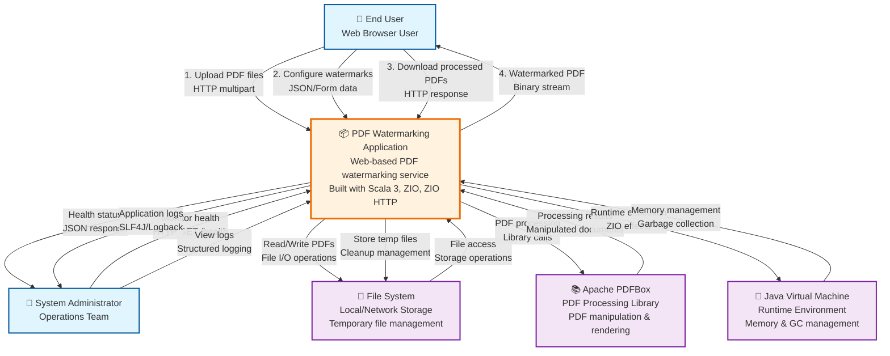

# C1 Context Diagram - PDF Watermarking Application

**Version**: 1.0  
**Date**: 2025-08-22  
**Author**: Architecture Analysis  

## System Context

This diagram shows the PDF Watermarking Application in relation to its users and external systems.

## Legend

| Symbol | Meaning |
|--------|---------|
| 👤 | Person/User |
| 📦 | Software System |
| 💾 | Data Store |
| 🔧 | Runtime/Platform |
| 📚 | External Library |

## System Boundary

**Inside the boundary**: PDF Watermarking Application
- Web interface for file upload and configuration
- PDF processing and watermark application
- Session and temporary file management
- Health monitoring and logging

**Outside the boundary**: External actors and dependencies
- End users accessing via web browsers
- System administrators for monitoring
- File system for storage
- JVM runtime environment
- Apache PDFBox library for PDF operations

## Key Data Flows

1. **PDF Upload**: Users upload PDF files via multipart HTTP requests
2. **Configuration**: Users submit watermark configuration as JSON
3. **Processing**: Application processes PDFs using PDFBox library
4. **Storage**: Temporary files managed on local/network file system
5. **Download**: Processed PDFs delivered as HTTP binary responses
6. **Monitoring**: Health checks and structured logging for operations

## Quality Attributes

- **Usability**: Web-based interface accessible via standard browsers
- **Reliability**: Graceful error handling and recovery
- **Performance**: Efficient PDF processing with memory management
- **Security**: File validation and secure temporary file handling
- **Operability**: Health monitoring and structured logging
- **Maintainability**: Modular architecture with clear boundaries