# C2 Container Diagram - PDF Watermarking Application

**Version**: 1.0  
**Date**: 2025-08-22  
**Author**: Architecture Analysis  
**Related**: [C1 Context](./c1-context.md)

## Container Architecture

This diagram shows the high-level technology choices and how containers communicate within the PDF Watermarking Application.

```mermaid
graph TB
    %% External Actors
    User[👤 End User<br/>Web Browser]
    SysAdmin[👤 System Administrator<br/>Operations Team]
    
    %% Application Containers
    subgraph "PDF Watermarking Application"
        WebServer[🌐 Web Server<br/>ZIO HTTP 3.0.0<br/>- Static file serving<br/>- REST API endpoints<br/>- CORS & middleware<br/>- Session management]
        
        PDFEngine[⚙️ PDF Processing Engine<br/>Scala 3.3.6 + PDFBox 3.0.3<br/>- Watermark rendering<br/>- PDF manipulation<br/>- Multi-page processing<br/>- Error handling]
        
        FileManager[📁 File Management<br/>ZIO + File I/O<br/>- Upload handling<br/>- Temp file cleanup<br/>- Download serving<br/>- Storage management]
        
        ConfigService[⚙️ Configuration Service<br/>ZIO Config 4.0.2<br/>- App configuration<br/>- Environment settings<br/>- Validation rules<br/>- Runtime parameters]
    end
    
    %% Data Stores & External Systems
    TempStorage[💾 Temporary File Storage<br/>Local File System<br/>- Uploaded PDFs<br/>- Processed outputs<br/>- Session data<br/>- Automatic cleanup]
    
    LogStore[📝 Log Storage<br/>Logback + SLF4J2<br/>- Structured logging<br/>- Performance metrics<br/>- Error tracking<br/>- Audit trails]
    
    %% External Dependencies
    PDFBox[📚 Apache PDFBox 3.0.3<br/>PDF Processing Library<br/>- PDF parsing<br/>- Content manipulation<br/>- Rendering engine<br/>- Font management]
    
    JVM[🔧 JVM Runtime<br/>Java Virtual Machine<br/>- ZIO effect execution<br/>- Memory management<br/>- Garbage collection<br/>- Thread pools]
    
    %% User flows
    User -->|HTTP Requests<br/>Upload/Config/Download| WebServer
    WebServer -->|Processed PDFs<br/>JSON responses| User
    
    %% Admin flows
    SysAdmin -->|Health checks<br/>Monitoring| WebServer
    WebServer -->|Status & metrics<br/>JSON responses| SysAdmin
    
    %% Internal container communication
    WebServer -->|PDF processing requests<br/>ZIO effects| PDFEngine
    WebServer -->|File operations<br/>Upload/Download| FileManager
    WebServer -->|Config access<br/>Settings & rules| ConfigService
    
    PDFEngine -->|Watermark application<br/>Library calls| PDFBox
    PDFEngine -->|File I/O operations<br/>Read/Write PDFs| FileManager
    PDFEngine -->|Processing config<br/>Watermark parameters| ConfigService
    
    FileManager -->|File operations<br/>Read/Write/Delete| TempStorage
    FileManager -->|Cleanup operations<br/>Storage management| TempStorage
    
    %% Logging flows
    WebServer -.->|Request/Response logs<br/>Structured events| LogStore
    PDFEngine -.->|Processing logs<br/>Performance metrics| LogStore
    FileManager -.->|File operation logs<br/>Storage events| LogStore
    ConfigService -.->|Config change logs<br/>Validation errors| LogStore
    
    %% Runtime dependencies
    WebServer -->|ZIO HTTP execution<br/>Effect management| JVM
    PDFEngine -->|ZIO effect execution<br/>Memory allocation| JVM
    FileManager -->|File I/O operations<br/>Resource management| JVM
    ConfigService -->|Configuration loading<br/>Environment access| JVM
    
    %% Styling
    classDef userClass fill:#e1f5fe,stroke:#01579b,stroke-width:2px
    classDef containerClass fill:#fff3e0,stroke:#ef6c00,stroke-width:2px
    classDef datastoreClass fill:#e8f5e8,stroke:#2e7d32,stroke-width:2px
    classDef externalClass fill:#f3e5f5,stroke:#7b1fa2,stroke-width:2px
    
    class User,SysAdmin userClass
    class WebServer,PDFEngine,FileManager,ConfigService containerClass
    class TempStorage,LogStore datastoreClass
    class PDFBox,JVM externalClass
```

## Technology Stack Summary

| Container | Technology | Version | Purpose |
|-----------|------------|---------|---------|
| Web Server | ZIO HTTP | 3.0.0 | HTTP server, routing, middleware |
| PDF Engine | Scala + ZIO | 3.3.6 + 2.1.9 | Business logic, effects |
| File Manager | ZIO + JVM I/O | 2.1.9 | File operations, cleanup |
| Config Service | ZIO Config | 4.0.2 | Configuration management |

## External Dependencies

| Dependency | Version | Purpose |
|------------|---------|---------|
| Apache PDFBox | 3.0.3 | PDF processing and manipulation |
| ZIO JSON | 0.7.3 | JSON encoding/decoding |
| Logback | 1.4.14 | Logging implementation |
| JVM | 8+ | Runtime environment |

## Container Responsibilities

### Web Server (ZIO HTTP)
- **HTTP Request Handling**: Multipart uploads, JSON APIs
- **Static Content**: Serves web interface assets
- **Session Management**: User session tracking
- **Middleware**: CORS, logging, error handling
- **API Endpoints**: Upload, configure, download, health

### PDF Processing Engine
- **Watermark Rendering**: Text placement, rotation, colors
- **PDF Manipulation**: Page processing, document modification
- **Configuration Processing**: Watermark parameter handling
- **Error Management**: Typed error handling with ZIO
- **Performance Monitoring**: Processing metrics and timing

### File Management
- **Upload Processing**: Temporary file creation and validation
- **Storage Management**: File lifecycle and cleanup
- **Download Serving**: Processed file delivery
- **Resource Cleanup**: Automatic temporary file removal
- **Storage Monitoring**: Disk usage and limits

### Configuration Service
- **Application Config**: Server settings, limits, paths
- **Environment Management**: Dev/test/prod configurations
- **Validation Rules**: Input validation and business rules
- **Runtime Parameters**: Dynamic configuration loading

## Data Flow Patterns

1. **Upload Flow**: User → Web Server → File Manager → Temp Storage
2. **Processing Flow**: Web Server → PDF Engine → PDFBox → File Manager
3. **Configuration Flow**: Web Server → Config Service → PDF Engine
4. **Download Flow**: User → Web Server → File Manager → Temp Storage
5. **Logging Flow**: All Containers → Log Store (async)

## Quality Attributes

- **Scalability**: Stateless containers, ZIO fiber concurrency
- **Reliability**: Supervised effects, graceful error handling
- **Performance**: Streaming I/O, efficient memory usage
- **Maintainability**: Clear separation of concerns, modular design
- **Operability**: Structured logging, health endpoints, metrics